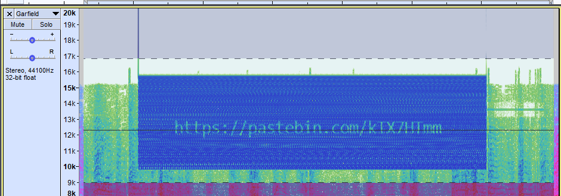
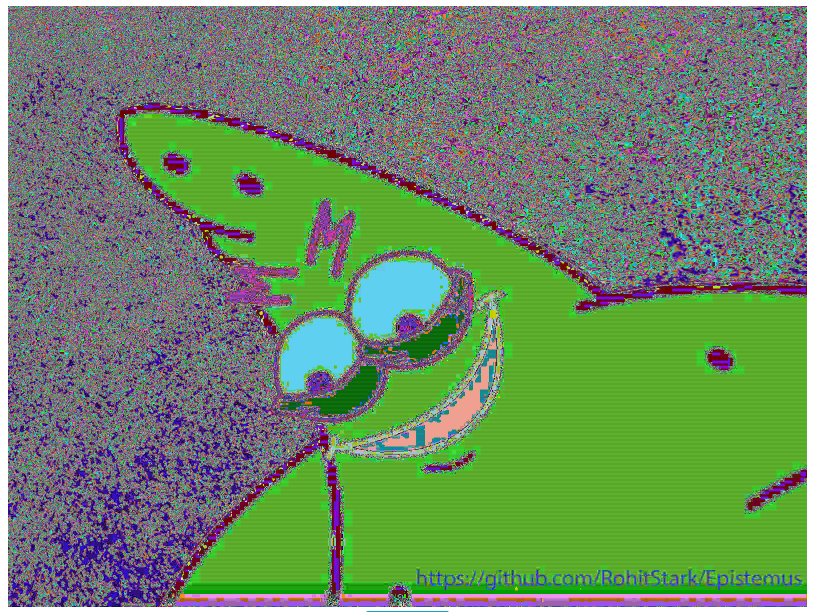

# **So Forgetful!**

From the challenge description, we need to get a password from a pcp file.  
Our tool of choice to analyse the file will be **Wireshark**.

Looking in the file, we see that it contains 231 packets. To make our job easier, we will keep only HTTP POST requests.  
The reason being that we are looking for a password, and that passwords are usually sent over POST requests on the network.

The filter for this on Wireshark is: `http.request.method == "POST"`


We are down to only one packet, and we can see the user ID in plaintext and the password in Base64 format (we can tell with the trailing '=').

Decoding the pswrd field gives us the password we were looking for:

```bash
$ echo 'S04xWjZQWFZ5OQ==' | base64 -d
KN1Z6PXVy9
```

The flag we submitted was **VishwaCTF{KN1Z6PXVy9}**

---

# **The Last Jedi**

In this challenge we are presented with an image titled *Y0D4.jpg*


Running steganography tools and checking the metadata didn't reveal a lot of information.  
Although in the metadata we found a suspicious comment:

``` bash
$ ./exiftool.exe Y0D4.jpg
...
Comment                         : CREATOR: gd-jpeg v1.0 (using IJG JPEG v80), quality = 100.
...
```

We know it was probably left by the tool which did something to the file. But in the end we managed to solve the challenge without looking into the tool.

While checking suspicious strings present in the file we found this using the strings utility in bash:

```bash
$ strings Y0D4.jpg | grep flag
flag:{f00l3d_y0u}Rar!
```

The flag was probably not VishwaCTF{f00l3d_y0u} so we kept digging. We noticed the suspicious Rar string present and suspected that there may have been a rar archive included in the file.

Creating a copy with a rar extention we tested that theory:

```bash
$ cp Y0D4.jpg Y0D4.rar
```

And bingo! we can open the file with Winrar and extract it's content.

We can extract an image in the folders `Sacred archives/Dont open/Is_This_Really_It.jpg`


Running strings on the image gave us the flag:

```bash
$ strings Is_This_Really_It.jpg
...
flag:{H1DD3N_M34N1NG}
```

The flag was **VishwaCTF{H1DD3N_M34N1NG}**

---

# **Keep the flag high**

We are provided with a file `sail_the_ship.bmp`. But it seems that it isn't actually a bmp file (we can't open it directly).

A quick note that will be relevant later:

In the description of the challenge we noticed this sentence:

> Can you rotate the ch4n7es in your favor?

So we might expect a ROT 47 cipher to be present in this challenge.

Going back to our file. Using an hex editor we can quickly see an IHDR string near the top. Which is typical of a PNG file.

To fix the file, we took a random PNG file from the internet and copied the first few bytes of the header to fix the magic bytes.

The first seven bytes became:

12 22 3C 22 AA 2E EE 22 -> 89 50 4E 47 0D 0A 1A 0A

The magic bytes being fixed, now our computer can understand it as being a png file:


The qr code present in the file was quickly decoded with an online qr decoder: <https://zxing.org/w/decode.jspx>

This is a link to an online drive: <https://drive.google.com/drive/folders/1gpcc6253bQ_-DZKjKYjGcBo0Y_w01iiB?usp=sharing>

On this drive folder, we recovered another image: pirate.jpeg


Running strings on this image gives us another suspicious looking string:

```bash
$ strings pirate.jpeg
...
ZxW
ZxW
trYAB_9
NDF_:5bE0D:0d4:D?bC_7Lu%r2H9D:'
IEND
```

Putting `NDF_:5bE0D:0d4:D?bC_7Lu%r2H9D:'` on Cyberchef, we tried to use the ROT47 algorithm mentionned in the description earlier. And Bingo!

<https://gchq.github.io/CyberChef/#recipe=ROT47(47)Reverse('Character')&input=TkRGXzo1YkUwRDowZDQ6RD9iQ183THUlcjJIOUQ6Jw>

We got the flag **VishwaCTF{f0r3nsic5_is_t3di0us}**

---

# **Garfeld?**

For this challenge, we were left with an audio file: Garfield.wav

Listening to the file we can hear some high pitch noise between the 30s and 35s mark.

Watching the spectrogram with Audacity at first doesn't reveal anything, but looking at the default spectrogram settings in Audacity, we can see that they use Min Frequency: 0 Hz and Max Frequency: 8000 Hz.  

Maybe the high pitch noise we heard wasn't in this range?  
So we changed the Min Frequency to 8000 Hz and the Max to 20000 Hz to check out if anything was hidden there.

And we got something:



The pastebin link is <https://pastebin.com/kTX7HTmm>. And it contains either Base32 or hex data:

```bash
$ head Question.txt
D27F92398FD92D384946000101010060
00600000FFE1002E4578696600004D4D
002A0000000800025100000400000001
00000000510100030000000100010000
00000000FFDB00430002010102010102
02020202020202030503030303030604
040305070607070706070708090B0908
080A0807070A0D0A0A0B0C0C0C0C0709
0E0F0D0C0E0B0C0C0CFFDB0043010202
02030303060303060C0807080C0C0C0C
```

This data being non coherent as Base32, we interpreted it as hexadecimal values and decoded it into a file:

```bash
$ xxd -p -r Question.txt > out.data
```

We noticed that the final bytes of the files were FF D9 and that it was typical of a JPEG file. Unfortunately, it looks like the header bytes still don't agree with the format, so we copied the first few bytes of another jpeg file to fix it.

The first seven bytes became:

D2 7F 92 39 8F D9 2D 38 -> FF D8 FF E0 00 10 4A 46

And we got this image:


Rotating and zooming on it we can see a hidden string that looks like our flag:


The string we are working with is `xjslxjKCH{j_hidtqw_npvi_mjajioa}`

Of the several decryption we tried, the one that yielded a satisfying result is the Vigenère decoder (the equivalent of Caesar but with several keys).

The flag format of the event is VishwaCTF{flag} so we know the first part of the string is vishwaCTF, entering this as our key gives us `cbaebjIJC{o_zqwxqu_ukaa_ucejgvv}` (<https://gchq.github.io/CyberChef/#recipe=Vigen%C3%A8re_Decode('vishwaCTF')&input=eGpzbHhqS0NIe2pfaGlkdHF3X25wdmlfbWphamlvYX0>).

To decode the flag we entered the first part of the string without the "c" at the end since it looks like it repeats the first part of the key. The final key that gave us our flag was "cbaebjij".

<https://gchq.github.io/CyberChef/#recipe=Vigen%C3%A8re_Decode('cbaebjij')&input=eGpzbHhqS0NIe2pfaGlkdHF3X25wdmlfbWphamlvYX0>

And our flag for the challenge was **vishwaCTF{i_heckin_love_lasagna}**

---

# **Epistemus** (Unsolved but we made progress during the event)

The challenge provides us with an image: patrick.jpg

A quick check for lsb half data in the file gives us a link to a github repository. (The check was done using this tool <https://stegonline.georgeom.net/image>)



The link is <https://github.com/RohitStark/Epistemus>.

We first cloned the repository, then checked the history of commits. Unfortunately, checking out the previous commits triggers an error with the weirdly named `rightplace?.txt` file.

To bypass this error we changed a config in the repository. All of this in succession looks like this:

```bash
$ git clone https://github.com/RohitStark/Epistemus.git
$ git config core.protectNTFS false
$ git checkout 077d4a0e07aa00c6b7a3d4eebf4b406a3f752a1e # Commit with zipbomb-20210121.zip which is deleted on later commits
```

Unfortunately this is where we hit a wall on this challenge, one thing we didn't try yet is checking all of the different README.md differences to check for anything suspicious. We couldn't find the password to the rar archive and the zipbomb looks like to be an utility to create zipbombs.

In the interest of time, we focused on other challenges during the event.

---
