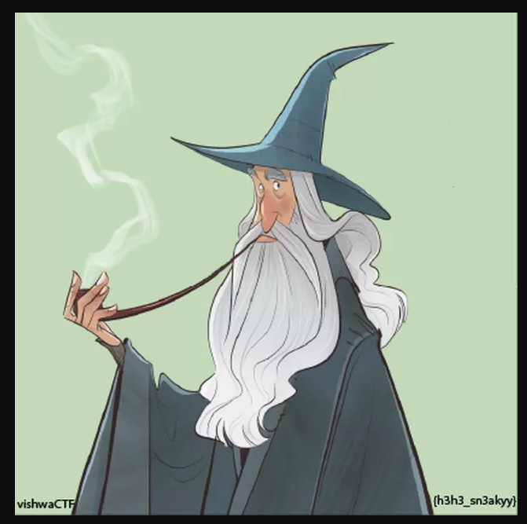
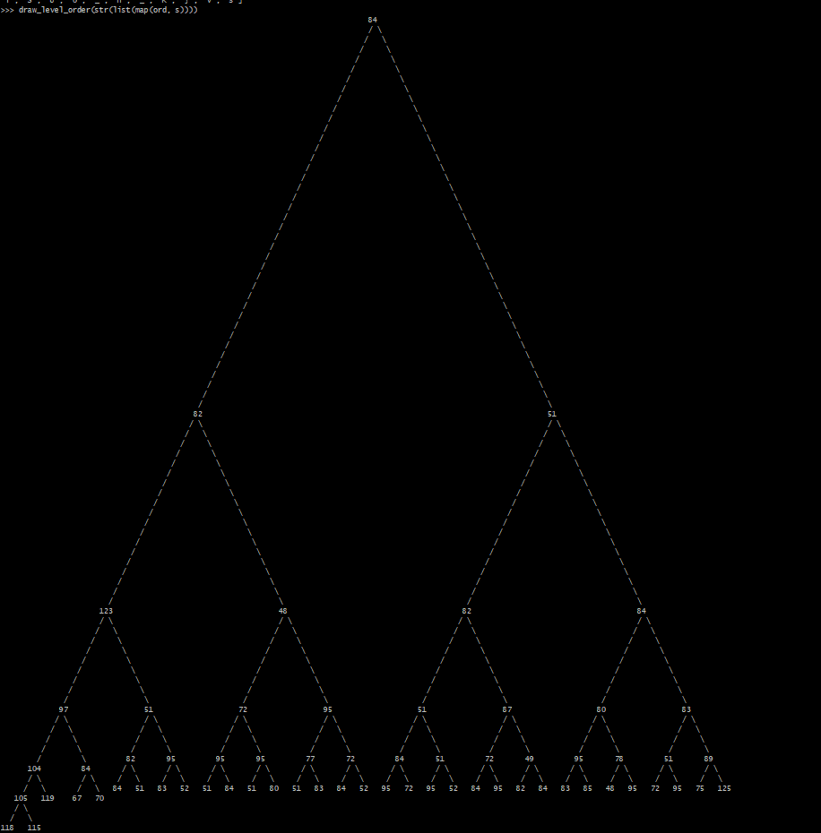

# **I don't need sleep, I need answers**

For this challenge, we need to recover the profile picture of the Librarian bot present in the CTF's discord. On discord the profile pictures appear circular, but in reality there is content to them that we cannot see in the corners. Here's the process on how we recovered the bot's profile picture image:

- First we send a private message to the bot (The Librarian#2695).
- Then we can connect to discord using the web interface (and not the app)
- Using F12 we can open the developer tools.
- We go to the Network tab.
- Refreshing the page and looking at the webp type of requests we can track down which one is the librarian.
- With this we Identified the Librarian's profile picture: <https://cdn.discordapp.com/avatars/953173381962948618/1b83941f7abbdfa15344f485e0c39677.webp?size=80>

Unfortunately for us, the size of the image is too small for our analysis, we can see the hidden strings in the bottom left and right corners but are unable to read them.

Fortunately for us, we can see the `?size=` argument on the image's link, changing the parameter to a random value like 200 doesn't seem to work, but multiples of 80 seem to work (80, 160, 240). To see things clearly we went to `?size=640` and got this:



Now we can clearly see our flag: **vishwaCTF{h3h3_sn3akyy}**

---

# **Forest Trails**

We start this challenge with 2 hints:

In the description the sentence:

> In order to survive, we need oxygen, and trees give us oxygen.

The string *In order* is in italic giving information that we probably need to reorder some data, and the focus on trees makes us think about Binary trees.

The second hint is the data that seems to constitute our flag:

```
084 082 051 123 048 082 084 097 051 072 095 051 087 080 083 104 084 082 095 095 095 077 072 084 051 072 049 095 078 051 089 105 119 067 070 084 051 083 052 051 084 051 080 051 083 084 052 095 072 095 052 084 095 082 084 083 085 048 095 072 095 075 125 118 115
```

Deciphering these values as decimal gives us the flag, but as you guessed not in order (<https://gchq.github.io/CyberChef/#recipe=From_Decimal('Space',false)&input=MDg0IDA4MiAwNTEgMTIzIDA0OCAwODIgMDg0IDA5NyAwNTEgMDcyIDA5NSAwNTEgMDg3IDA4MCAwODMgMTA0IDA4NCAwODIgMDk1IDA5NSAwOTUgMDc3IDA3MiAwODQgMDUxIDA3MiAwNDkgMDk1IDA3OCAwNTEgMDg5IDEwNSAxMTkgMDY3IDA3MCAwODQgMDUxIDA4MyAwNTIgMDUxIDA4NCAwNTEgMDgwIDA1MSAwODMgMDg0IDA1MiAwOTUgMDcyIDA5NSAwNTIgMDg0IDA5NSAwODIgMDg0IDA4MyAwODUgMDQ4IDA5NSAwNzIgMDk1IDA3NSAxMjUgMTE4IDExNQ>)

`TR3{0RTa3H_3WPShTR___MHT3H1_N3YiwCFT3S43T3P3ST4_H_4T_RTSU0_H_K}vs`

The first think we thought about was to put the data in a binary tree and try to read it using a different method (there are many ways to read data entered in a binary tree).  
The tool we found for the job was the drawtree python libaries. (We were a little too lazy to reimplement binary trees ourselves when we knew there were probably existing libraries that would do it for us).

Here's how our python session went:

```python
>>> from drawtree import draw_level_order
>>> s = 'TR3{0RTa3H_3WPShTR___MHT3H1_N3YiwCFT3S43T3P3ST4_H_4T_RTSU0_H_K}vs' # Direct conversion of the string given
>>> draw_level_order(str(list(map(ord, s)))) # list(map(ord, s)) changes the string to a list of decimal encoded numbers, the str() after that changes it to what draw_level_order wants
                                                                                  84
                                                                                  / \
                                                                                 /   \
                                                                                /     \
                                                                               /       \
                                                                              /         \
                                                                             /           \
                                                                            /             \
                                                                           /               \
                                                                          /                 \
                                                                         /                   \
                                                                        /                     \
                                                                       /                       \
                                                                      /                         \
                                                                     /                           \
                                                                    /                             \
                                                                   /                               \
                                                                  /                                 \
                                                                 /                                   \
                                                                /                                     \
                                                               /                                       \
                                                              /                                         \
                                                             /                                           \
                                                            /                                             \
                                                           /                                               \
                                                          /                                                 \
                                                         /                                                   \
                                                        /                                                     \
                                                       /                                                       \
                                                      /                                                         \
                                                     /                                                           \
                                                    /                                                             \
                                                   /                                                               \
                                                  /                                                                 \
                                                 /                                                                   \
                                                /                                                                     \
                                               /                                                                       \
                                              /                                                                         \
                                             /                                                                           \
                                            /                                                                             \
                                           82                                                                             51
                                          / \                                                                             / \
                                         /   \                                                                           /   \
                                        /     \                                                                         /     \
                                       /       \                                                                       /       \
                                      /         \                                                                     /         \
                                     /           \                                                                   /           \
                                    /             \                                                                 /             \
                                   /               \                                                               /               \
                                  /                 \                                                             /                 \
                                 /                   \                                                           /                   \
                                /                     \                                                         /                     \
                               /                       \                                                       /                       \
                              /                         \                                                     /                         \
                             /                           \                                                   /                           \
                            /                             \                                                 /                             \
                           /                               \                                               /                               \
                          /                                 \                                             /                                 \
                         /                                   \                                           /                                   \
                        /                                     \                                         /                                     \
                      123                                     48                                       82                                     84
                      / \                                     / \                                     / \                                     / \
                     /   \                                   /   \                                   /   \                                   /   \
                    /     \                                 /     \                                 /     \                                 /     \
                   /       \                               /       \                               /       \                               /       \
                  /         \                             /         \                             /         \                             /         \
                 /           \                           /           \                           /           \                           /           \
                /             \                         /             \                         /             \                         /             \
               /               \                       /               \                       /               \                       /               \
              /                 \                     /                 \                     /                 \                     /                 \
             97                 51                   72                 95                   51                 87                   80                 83
            / \                 / \                 / \                 / \                 / \                 / \                 / \                 / \
           /   \               /   \               /   \               /   \               /   \               /   \               /   \               /   \
          /     \             /     \             /     \             /     \             /     \             /     \             /     \             /     \
         /       \           /       \           /       \           /       \           /       \           /       \           /       \           /       \
        /         \         82       95         95       95         77       72         84       51         72       49         95       78         51       89
      104         84       / \       / \       / \       / \       / \       / \       / \       / \       / \       / \       / \       / \       / \       / \
      / \         / \     /   \     /   \     /   \     /   \     /   \     /   \     /   \     /   \     /   \     /   \     /   \     /   \     /   \     /   \
     /   \       /   \   84   51   83   52   51   84   51   80   51   83   84   52   95   72   95   52   84   95   82   84   83   85   48   95   72   95   75   125
   105   119    67   70
   / \
  /   \
118   115
>>> solution = [118, 105, 115, 104, 119, 97, 84, 67, 70]; ''.join(map(chr, solution)) # Here's our trial and error to check how the data is read, and yes I manually entered all of it by hand... It took a while but it was worth it
'vishwaTCF'
>>> solution = [118, 105, 115, 104, 119, 97, 67, 84, 70]; ''.join(map(chr, solution))
'vishwaCTF'
>>> solution = [118, 105, 115, 104, 119, 97, 67, 84, 70, 123, 84, 82, 51, 51, 83, 95, 52, 82, 51]; ''.join(map(chr, solution))
'vishwaCTF{TR33S_4R3'
>>> solution = [118, 105, 115, 104, 119, 97, 67, 84, 70, 123, 84, 82, 51, 51, 83, 95, 52, 82, 51, 95, 84, 72, 51, 95, 80]; ''.join(map(chr, solution))
'vishwaCTF{TR33S_4R3_TH3_P'
>>> solution = [118, 105, 115, 104, 119, 97, 67, 84, 70, 123, 84, 82, 51, 51, 83, 95, 52, 82, 51, 95, 84, 72, 51, 95, 80, 48, 51, 77, 83, 95, 84, 72, 52]; ''.join(map(chr, solution))
'vishwaCTF{TR33S_4R3_TH3_P03MS_TH4'
>>> solution = [118, 105, 115, 104, 119, 97, 67, 84, 70, 123, 84, 82, 51, 51, 83, 95, 52, 82, 51, 95, 84, 72, 51, 95, 80, 48, 51, 77, 83, 95, 84, 72, 52, 84, 95, 84, 72, 51, 95, 51, 52, 82, 84, 72, 95, 87, 82, 49, 84]; ''.join(map(chr, solution))
'vishwaCTF{TR33S_4R3_TH3_P03MS_TH4T_TH3_34RTH_WR1T'
>>> solution = [118, 105, 115, 104, 119, 97, 67, 84, 70, 123, 84, 82, 51, 51, 83, 95, 52, 82, 51, 95, 84, 72, 51, 95, 80, 48, 51, 77, 83, 95, 84, 72, 52, 84, 95, 84, 72, 51, 95, 51, 52, 82, 84, 72, 95, 87, 82, 49, 84, 51, 83, 95, 85, 80, 48, 78, 95, 84, 72, 51, 95, 83, 7
5, 89, 125]; ''.join(map(chr, solution))
'vishwaCTF{TR33S_4R3_TH3_P03MS_TH4T_TH3_34RTH_WR1T3S_UP0N_TH3_SKY}'
```

Here's an image of the full tree at a reduced size if the one above is a little too cramped:



The order of the elements went like this:

```python
         4
        / \
       /   \
      /     \
     /       \
    /         \
   3           6
  / \         / \
 /   \       /   \
1     2     5     7
```

The flag we got was: **vishwaCTF{TR33S_4R3_TH3_P03MS_TH4T_TH3_34RTH_WR1T3S_UP0N_TH3_SKY}**

---

# **Am I too fair?**

We are given a list of emojis and a photo that was presumably the origin of this list.


We can clearly see a space between every three emojis, giving us the idea that the emojis may represent data using 3 values.

We also observed that the first emoji was always either the crying one or the blushing one, if these emojis were to represent numbers, this would be for example a 0 or a 1. Leaving us the idea that every emoji represents a number and that the representation is either in octal or decimal value of a text.

Counting the number of unique emojis gave us a total of 8, further reinforcing our theory about them being octal numbers.

I tried using logic and the ascii table to find out the value of each emojis, but found it way easier to just bruteforce all of the options with a script:

```python
import itertools

"""
Cry:    o (1)
Blush:  h (0)
Angry:  a
Sleep:  z
Smile:  w
Tissue: t
Snow:   x
Think:  b

oha hah ozz ohz hao ohw ohw hat ooa otx oha ozz ozb hao ozw

I suspect it's an octal encoding
"""
# I assumed the crying emojis was a 1 and the blushing one a 0, at first I tried the reverse but it didn't give me anything
decoded = {
    'o': '1',
    'h': '0',
    ' ': ' '
}

# I translated the emojis to letters in order to have something simple to decode
cipher = "oha hah ozz ohz hao ohw ohw hat ooa otx oha ozz ozb hao ozw"

# This will translate a letter with it's numerical value in the decoded dictionnary
decode = lambda x: decoded[x] if x in decoded.keys() else x

print(''.join(map(decode, cipher)))

leftover = "azwtxb" # Emojis I need to decode
perms = list(itertools.permutations([2, 3, 4, 5, 6, 7])) # All possible permutation of the remaining digits

for p in perms:
    decoder = decoded
    for i, l in enumerate(leftover):
        decoder[l] = str(p[i]) # Produce a dictionary with the values of the current permutation
    
    # Use this dictionnary as the decoder
    decode = lambda x: decoder[x]
    d = ''.join(map(decode, cipher)) # Produce string with octal numbers
    final = ''.join(map(chr, map(lambda x: int(x, 8), d.split(' ')))) # Translate octal numbers to characters
    print(final, decoder) # print string and key
```

Running the script gave us a good looking possibility very quickly:

```python
$ python solve.py
...
F0RB1DD3N_FRU1T {'o': '1', 'h': '0', ' ': ' ', 'a': '6', 'z': '2', 'w': '4', 't': '3', 'x': '7', 'b': '5'}
...
```

The flag was: **VishwaCTF{F0RB1DD3N_FRU1T}**

---

# **Chess** (Unsolved during the event but I at least found the mate in 4)

We are provided some hints and a chess position.

The original position: <https://www.chess.com/a/2i9NSPPVgna5L>.

There is an encryption referenced in the description, the Beafort: <https://www.dcode.fr/chiffre-beaufort>.

The other hint "In this game being stable is key." was apparently supposed to say that the pieces that didn't move were supposed to compose the text we were supposed to dectypt.

As this challenge was released in the second half of the event. We unfortunately didn't have enough time to figure it out.

---
